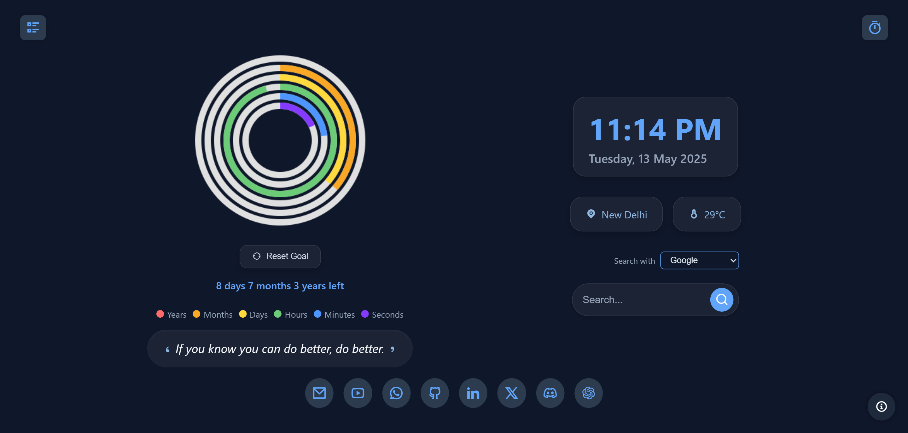

# Veridian – Grow Your Future, Today

Veridian is a productivity-focused Chrome extension that reimagines the new tab experience. By combining visual time-tracking with motivational tools, it helps you stay mindful of your goals and make the most of every day.

 

---


## 🚀 Features

- 🕰️ **Life Countdown** – Visualize how much time you have left until your target goal year using animated concentric rings.
- 📆 **Live Clock & Date** – Displays your current time and date.
- 🌍 **Auto Location + Temperature** – Shows your approximate location and current temperature using a lightweight geolocation service.
- 💬 **Motivational Quotes** – Fresh daily inspiration to keep your spirits high.
- 🔗 **Quick Shortcuts** – Customizable links to your favorite sites.
- ✅ **To-Do List** – Track your tasks directly in the tab.
- ⏲️ **Pomodoro Timer** – Stay productive with customizable focus sessions.
- ℹ️ **Info & Contact Modal** – Learn more about Veridian and find links to reach the creator.

---

## 🛠️ Tech Stack

- **HTML, CSS, JavaScript**
- **Chrome Extensions API (Manifest V3)**
- **Nominatim (OpenStreetMap)** – for reverse geolocation
- **wttr.in** – for weather (no API key required)

---

## 📦 Installation

1. Clone or download this repository:
   ```bash
   git clone https://github.com/your-username/veridian.git
   ```
2. Go to `chrome://extensions/` in your browser.
3. Enable Developer Mode (top-right).
4. Click Load unpacked and select the veridian project folder.
5. Open a new tab and explore your new dashboard!

---

## 🧠 About

*“Veridian” is built to help you visualize your life journey and stay focused on your long-term goals. Make each day count.*

---

## 📬 Contact

**Built with 💙 by Solanki**

[✉️ Gmail](solankisingha23@gmail.com) | 
[🐙 GitHub](https://github.com/solanki03) |
[💼 LinkedIn](https://www.linkedin.com/in/solankisingha) 

---

## 📄 License
This project is licensed under the **[MIT License](https://choosealicense.com/licenses/mit/)**. See the LICENSE file for more details.
